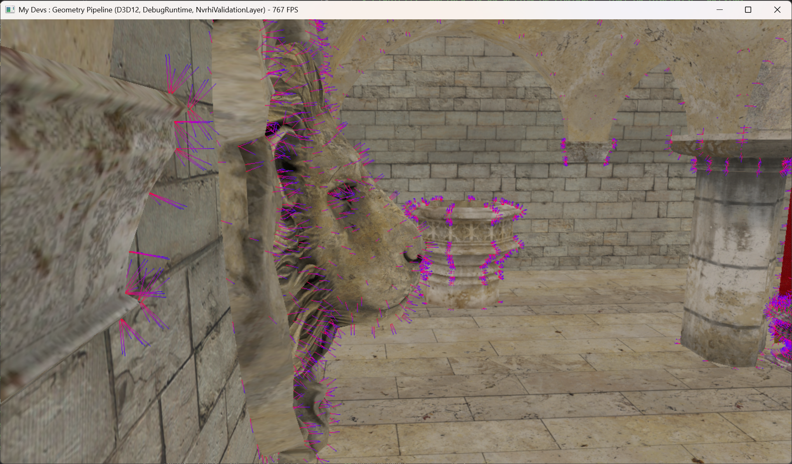

# Geometry Pipeline

# Geometry Shader - Normal Debugging

Keyword: normal debugging, geometry shader, bindless rendering

## 흐름

1. Vertex Shader 에서 World Space까지만 변환
2. Geometry Shader에서 두 point를 lineStream에 append
    - p0는 worldPos * projection
    - p1는 (worldPos + normal) * projection